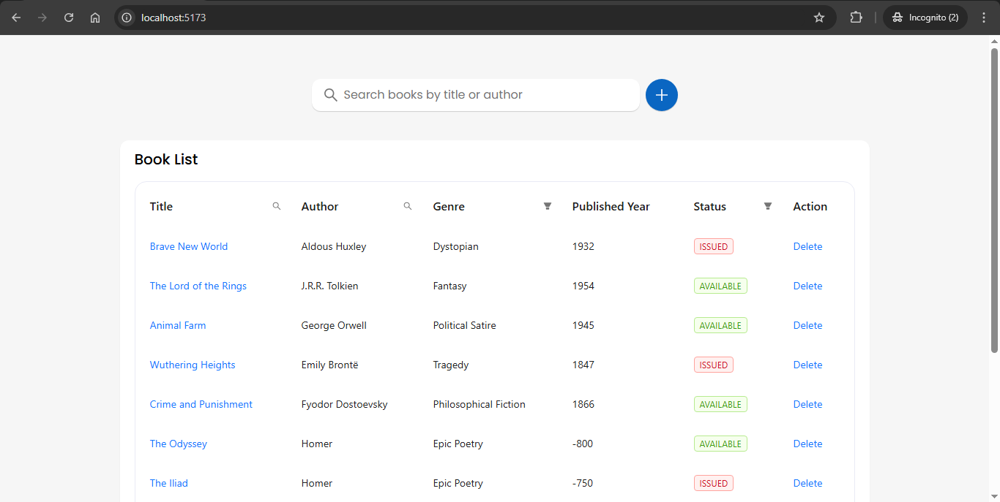

# Book Management Dashboard

A responsive React.js dashboard application for managing books. This app allows users to perform CRUD operations on a list of books with a mock API. The app integrates features like pagination, search, filters, and more, making it a useful tool for managing a collection of books.

### Technologies Used:
- **React.js** for building the frontend
- **Ant Design** and **Tailwind CSS** for UI components and styling
- **React Query** for API calls
- **json-server** to mock the API
- **React Hook Form** for form validation
- **Spinners** to indicate loading during data fetching
- **React Router** for navigation

### Setup Instructions:

1. **Clone the Repository**
   ```bash
   git clone https://github.com/rupeshpatil27/book-management-dashboard.git
   cd book-management-dashboard

2. **Install Dependencies**
   ```bash
   npm install

3. **Run the Mock API**
   To start the mock API using json-server, run the following
   ```bash
   npx json-server src\api\data.json

3. **Run the App**
   In the root directory of the project, run App

## Screenshot 📸

  

